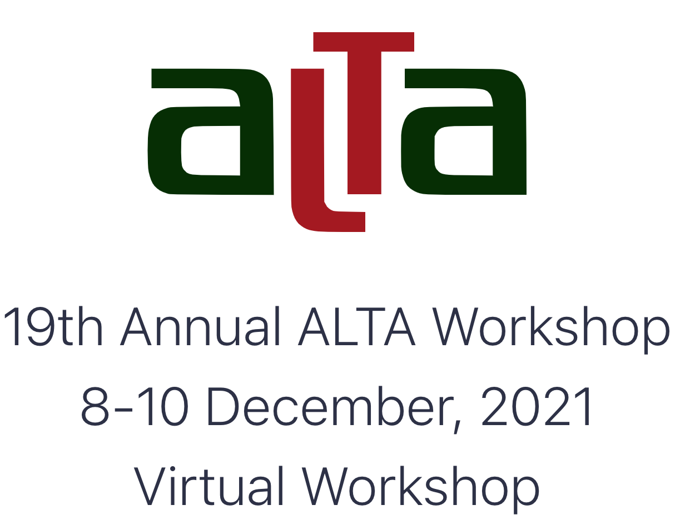

# ALTA 2021 - Tutorial Code 

#### 1,2Jacob Parnell, 1,2Inigo Jauregi Unanue and 1Prof. Massimo Piccardi
1University of Technology Sydney (UTS)

2RoZetta Technology

## Introduction

This is the code used in the tutorial at the
[19th Annual Workshop of the Australasian Language Technology 
Association (ALTA 2021)](https://alta2021.alta.asn.au/).
You can find the slides of the presentation here(link needs to be 
insterted). 

In this code repository we show how to train neural machine translation
and abstractive summarisation models using [PyTorch Lightning](https://www.pytorchlightning.ai/), a 
framework meant to remove the "boilerplate" from the development of 
research models.

## Getting Started

We provide two notebooks (one for translation and one for summarisation) as part of the tutorial. You can run this on 
Jupyter notebooks or Google-colab.

### Translation

Check the [translation folder](https://github.com/ijauregiCMCRC/ALTA2021_tutorial/tree/main/translation) to 
start with this section of the tutorial.

### Summarisation

Check the [summarisation folder](https://github.com/ijauregiCMCRC/ALTA2021_tutorial/tree/main/summarisation) to 
start with this section of the tutorial.
