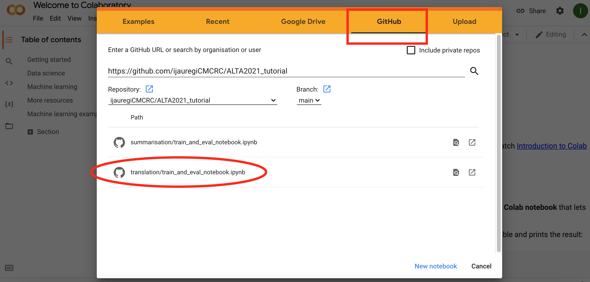

# Neural Machine Translation (NMT) model training
________

## Introduction

In this section of the tutorial we show how quickly to train a
state-of-the-art NMT model.

We provide the code to leverage pretrained BART (Lewis et al., 2019) and mBART (aka multilingual BART) 
models available in [Huggingface](https://huggingface.co/). Additionally, we show how train a model using
adapters from the [AdapterHub](https://adapterhub.ml/).

## Code structure

```python
src
  - __init__.py
  - translation_dataset.py
  - translation_lightning_model.py
  - translation_metrics.py
requirements.txt
train_and_eval_notebook.ipynb
```

The `src` folder contains the code needed by the notebook to train an NMT model with 
`pytorch_lightning` (`translation_lightning_model.py`), to load the train, dev and 
test sets (`translation_dataset.py`), and to calculate different evaluation metrics.

The `requirements.txt` file contains the python packages needed for this section of the tutorial.

`train_and_eval_notebook.ipynb` is the python notebook that we run in the tutorial.

## Notebook tasks

The notebook is easy to follow, with multiple comments at each step to understand
what each block of code does.

The notebook is divided in two main tasks:

1. Train and evaluate a NMT model
2. Compare the performance of three models previously trained by us (using the same code)
   1. `BART_base`
   2. `BART_base_with_adapter`
   3. `mBART_large_with_adapter`


## Getting started

The notebook can be run in Jupyter Notebooks or in Google Colab. The following 
section shows how to start using the notebook in Google Colab.

### Google Colab

1. Open [Google Colab](https://colab.research.google.com/?utm_source=scs-index)
2. Select GitHub as the source of notebook and paste this repository's URL (https://github.com/ijauregiCMCRC/ALTA2021_tutorial) 
3. Two notebooks will be available. Select the translation notebook (translation/train_and_eval_notebook.ipynb)
4. That should open the notebook in Google Colab. Select the instance type (i.e. CPU, GPU, TPU) and follow the notebook instructions.

## References

Lewis, Mike, et al. "Bart: Denoising sequence-to-sequence pre-training for natural language 
generation, translation, and comprehension." arXiv preprint arXiv:1910.13461 (2019).
